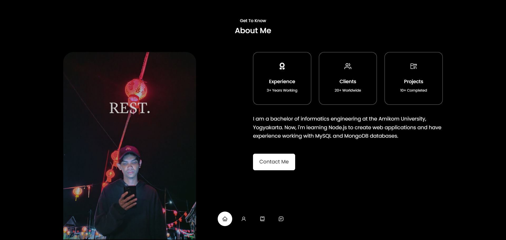

# Personal Website

>This is my personal website using React. On this website, I present some of my skills, work experience, and various website projects that I have worked on. [_here_](https://zulhaditya.netlify.app/).

## Table of Contents

- [Technologies Used](#technologies-used)
- [Screenshots](#screenshots)
- [Setup](#setup)
- [Project Status](#project-status)
- [Contact](#contact)

## Technologies Used

 - **react**: version 18.2.0
 - **react-icons**: version 4.9.0
 - **react-toast**: version 1.0.3
 - **typewriter-effect**: version 2.20.1

## Screenshots



## Setup

To customize and run this project, install it locally using npm:

```bash
$ cd ../personal-website
$ npm install
$ npm run dev
```

Open [http://localhost:5173](http://localhost:5173) with your browser to see the result.

## Project Status

Project is: _complete._ <!-- / _complete_ / _no longer being worked on_. reason ? -->

## Contact

Created by [@Zulhaditya](https://itsmyportofolio.netlify.app/) - feel free to contribute in this repository!
